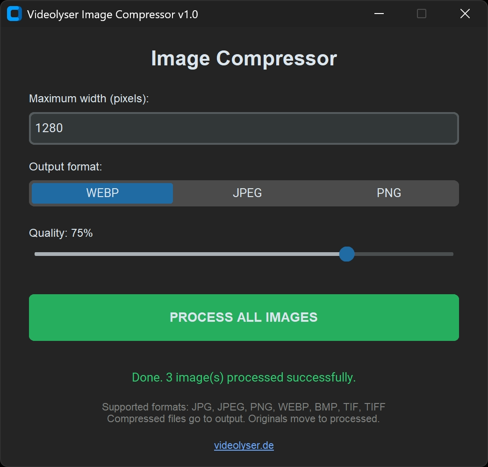

# Videolyser Image Compressor



A simple desktop image compression and conversion tool for faster websites, thumbnails and web-ready assets.

## Overview

Videolyser Image Compressor is a lightweight Python desktop app that helps you compress, resize and convert images quickly.

It is designed for creators, bloggers, website owners and anyone who wants to prepare images for the web with smaller file sizes and a simple workflow.

## Features

- Compress images for web use
- Convert images to WEBP, JPEG or PNG
- Resize images by maximum width
- Adjust compression quality
- Supports JPG, JPEG, PNG, WEBP, BMP, TIF and TIFF as input formats
- Automatically saves processed images to the `output` folder
- Automatically moves original files to the `processed` folder
- Simple desktop interface built with CustomTkinter

## Supported Formats

### Input
- JPG
- JPEG
- PNG
- WEBP
- BMP
- TIF
- TIFF

### Output
- WEBP
- JPEG
- PNG

## How It Works

1. Place your image files into the app folder
2. Start the app
3. Set your maximum width
4. Choose the output format
5. Adjust quality
6. Click **PROCESS ALL IMAGES**

Processed files will be saved in the `output` folder.  
Original files will be moved to the `processed` folder.

## Use Cases

- Compress blog images for faster websites
- Convert large image files into web-friendly formats
- Prepare thumbnails for YouTube or social media
- Resize images before uploading them to a website
- Create smaller assets for better loading performance

## Installation

### 1. Clone the repository

```bash
git clone https://github.com/Videolyser/videolyser-image-compressor.git
cd videolyser-image-compressor
```

### 2. Install dependencies

```bash
pip install -r requirements.txt
```

### 3. Run the app

```bash
python app.py
```

## Requirements

- Python 3.10 or newer
- customtkinter
- Pillow

## Project Structure

```text
videolyser-image-compressor/
├── app.py
├── requirements.txt
├── README.md
├── LICENSE
├── .gitignore
├── output/
│   └── .gitkeep
└── processed/
    └── .gitkeep
```

## Notes

- The app processes supported image files located in the same folder as `app.py`
- Processed files are written to the `output` folder
- Original image files are moved to the `processed` folder after processing
- The website button in the app opens `https://www.videolyser.de/`

## Roadmap

Planned future improvements may include:

- Drag and drop support
- Folder picker
- Compression presets
- Keep originals option
- Better preview workflow

## About Videolyser

Videolyser builds tools, components and practical solutions for video, streaming, creators and web publishing.

Website: https://www.videolyser.de/